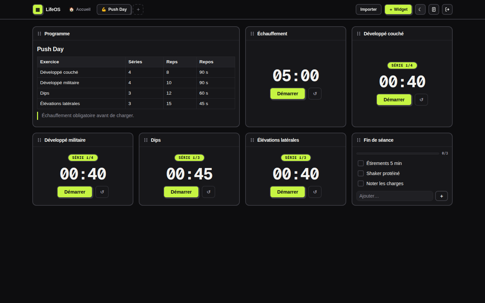
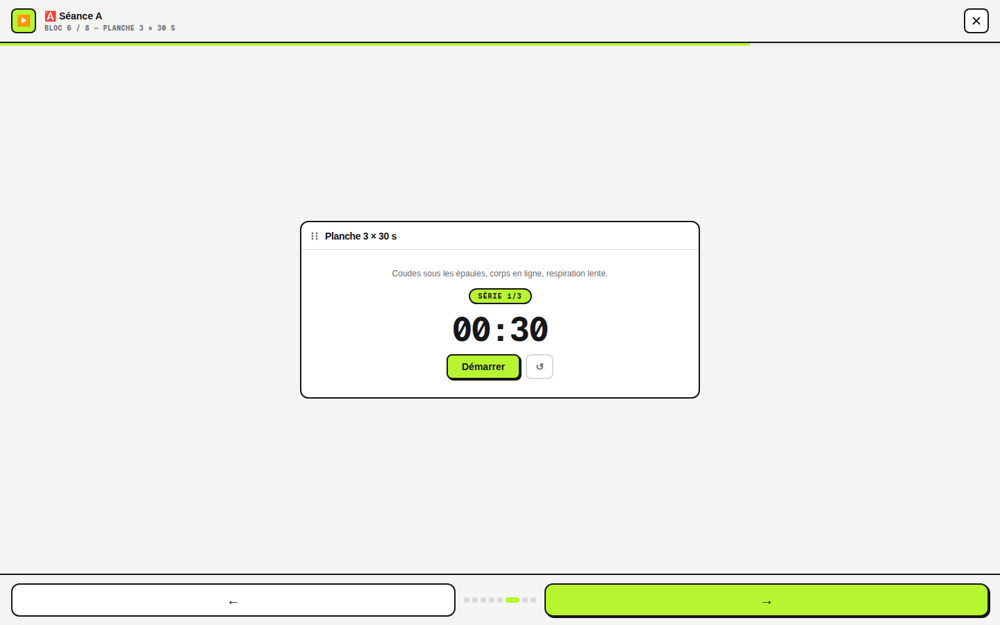
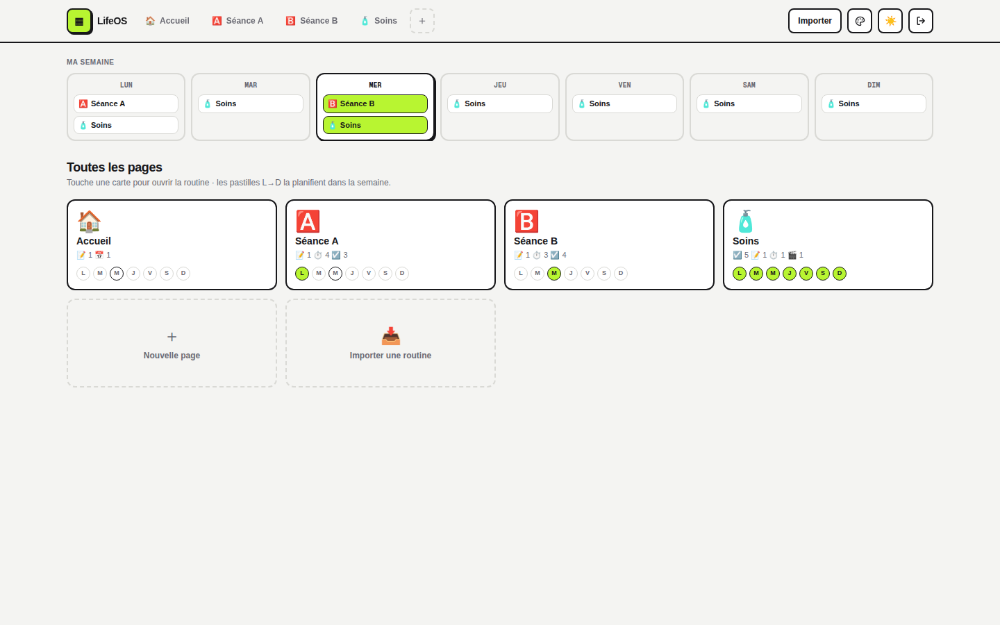
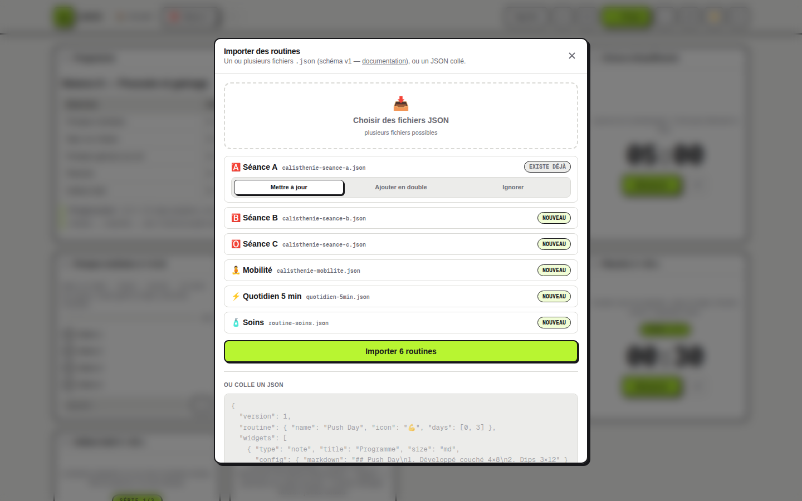
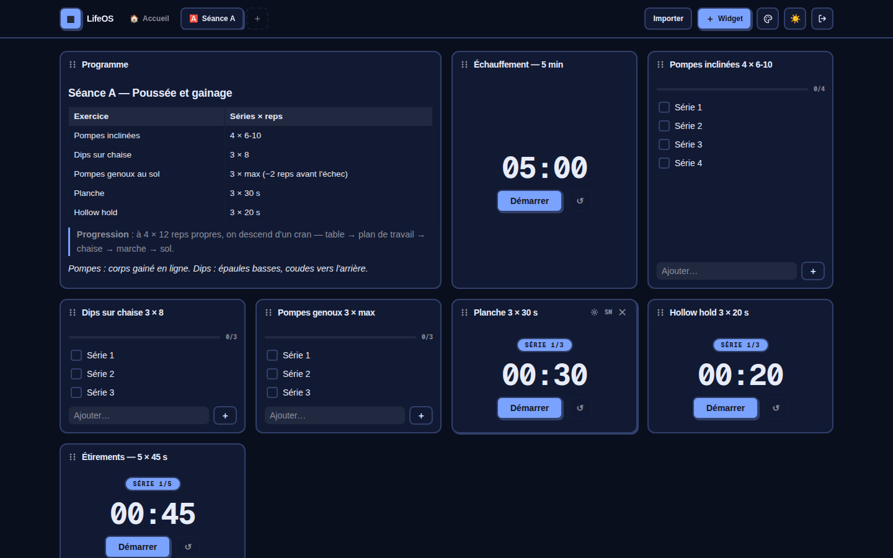
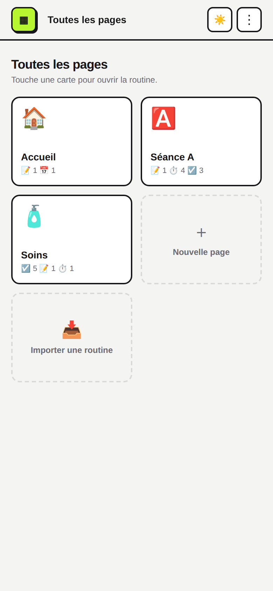

# ▦ LifeOS — Personal Life OS & Routine Hub

**Ton espace personnel modulaire, auto-hébergé, pour piloter tes routines au
quotidien** — sport, soins, focus, ménage, n'importe quel rituel — avec des
widgets configurables, un planning hebdomadaire, et un moteur d'importation
qui transforme n'importe quel programme généré par une IA en page prête à
l'emploi.

Pensé pour tourner chez toi (Home Assistant Green/Yellow, Raspberry Pi,
mini-PC), avec tes identifiants Home Assistant, sans cloud et sans compte
tiers : **tes données restent chez toi**.



## À quoi ça sert ?

LifeOS n'est pas un dashboard domotique de plus : c'est un **hub de
routines**. Quelques usages réels :

- 💪 **Séance de sport guidée** — le programme en Markdown, une check-list
  de séries par exercice, des timers d'intervalles (effort/repos avec bips),
  la vidéo de démo du mouvement, et le **mode Play** qui déroule la séance
  bloc par bloc en plein écran.
- 🧴 **Routine soins matin/soir** — check-lists qui se décochent seules
  chaque jour, rythmes hebdomadaires (gommage la veille du rasage, cheveux
  mercredi et dimanche…), liste de courses qui, elle, ne se réinitialise pas.
- 📅 **Organisation de la semaine** — chaque page s'attribue à un ou
  plusieurs jours, récurrents automatiquement ; la vue d'ensemble met le jour
  courant en avant, et le widget calendrier affiche tes événements
  Google/Apple du jour en lecture seule.
- 🤖 **Génération par IA** — demande à ChatGPT/Claude/Gemini un programme
  (« séance jambes 45 min », « routine skincare peau sèche »…) au format
  LifeOS : tu colles le JSON ou importes les fichiers, et la page se
  construit toute seule, widgets configurés, jours planifiés, palette
  comprise.

## Fonctionnalités

### Dashboard modulaire
- **Pages multiples** (une par routine), grille **drag & drop** (souris et
  tactile), widgets redimensionnables, **vue d'ensemble** de toutes les pages
  en cartes via le logo ▦.
- **Deux dispositions par page** : grille libre, ou **colonne ordonnée** pour
  suivre une séance dans l'ordre exact.
- **Mode Play ▶** : chaque bloc en grand, l'un après l'autre — flèches,
  clavier, progression ; les timers continuent de tourner d'un bloc à
  l'autre.
- **Verrou par page** 🔒 : structure figée, usage libre — aucune fausse
  manip en pleine séance.



### Les widgets
| Widget | Ce qu'il fait |
|---|---|
| 📝 **Bloc texte** | Markdown complet (tableaux, listes, citations). |
| ⏱ **Timer** | Chrono libre, minuteur, ou **séries** effort/repos × N avec bips — plus un champ consignes (charge, tempo, posture). |
| ☑️ **Check-list** | Progression, consignes sous le titre, **reset automatique chaque jour** (désactivable — parfait pour une liste de courses). |
| 📅 **Calendrier** | Événements du jour depuis un flux ICS (Google « adresse secrète », iCloud), lecture seule, bouton vers l'app native. |
| 🎬 **Média** | Photo, GIF ou vidéo en boucle, son optionnel — la lecture **se coupe hors écran** (zéro batterie/bande passante gaspillée). |

### Planning hebdomadaire
Des pastilles **L→D** sur chaque page ; la bande « Ma semaine » liste les
routines de chaque jour, récurrentes automatiquement, jour courant en avant.



### Importation IA (le moteur)
Le bouton **Importer** accepte **plusieurs fichiers JSON d'un coup** ou un
JSON collé. Si une page du même nom existe, tu choisis par fichier :
*mettre à jour* (en place, verrou et planning conservés), *ajouter en
double*, ou *ignorer*.

Le contrat que les IA doivent respecter est documenté et outillé :
- 📘 [Documentation du schéma v1](docs/ROUTINE_SCHEMA.md) — avec un prompt
  type à donner à ton IA
- 🧩 [JSON Schema machine](schema/routine.schema.json)
- 📂 [Fiches d'exemple prêtes à importer](examples/) — programme calisthénie
  complet (séances A/B/C, mobilité, bloc quotidien) et routine soins



### Personnalisation
- **Dark mode natif** (classe + préférence système) et panneau 🎨 :
  6 préréglages (Nuit, Blanc, Minuit, Sable, Forêt, Rose) et pipettes
  fond/cartes/texte/lignes/accent — **par utilisateur** ou **par page**.
  Les tons dérivés sont calculés pour garder le contraste.
- Une IA peut livrer une routine **avec sa palette** (`routine.theme`).



### Mobile
Interface adaptée au téléphone (barre compacte, menu ⋮, drag & drop par
appui long) et **PWA installable** : « Ajouter à l'écran d'accueil » donne
une vraie icône d'app plein écran.



### Multi-utilisateur & sécurité
- Connexion avec **tes identifiants Home Assistant** (API Supervisor en
  add-on, repli sur le `login_flow` officiel ; **TOTP/2FA supporté**). Aucun
  token stocké : LifeOS émet son propre cookie de session signé.
- **Chaque utilisateur a son propre dashboard**, stocké côté serveur et
  retrouvé sur tous ses appareils.
- Journal de connexions (date, IP, user-agent, résultat) dans
  `/data/auth-log.jsonl` et le Journal de l'add-on.
- Sans Home Assistant : compte local `APP_USER`/`APP_PASSWORD`.

## Installation

### Sur Home Assistant OS (Green, Yellow…) — recommandé

LifeOS s'installe comme un **add-on**, en 3 clics :

1. **Paramètres → Modules complémentaires → Boutique** → menu **⋮** →
   **Dépôts** → ajouter `https://github.com/DustProgram/lifeapp`

   [](https://my.home-assistant.io/redirect/supervisor_add_addon_repository/?repository_url=https%3A%2F%2Fgithub.com%2FDustProgram%2Flifeapp)

2. Installer la carte **LifeOS** (le premier build compile l'app sur place,
   compte quelques minutes) → **Démarrer** → **Ouvrir l'interface Web**.
3. Se connecter avec ses identifiants Home Assistant. C'est tout.

Détails, données et mise à jour : [`lifeos/DOCS.md`](lifeos/DOCS.md).
Pour l'avoir dans la barre latérale HA :

```yaml
panel_iframe:
  lifeos:
    title: LifeOS
    icon: mdi:view-dashboard
    url: http://IP_DE_TON_HA:3000
```

### Serveur Node autonome (IP fixe, NAS, VPS local)

```bash
git clone https://github.com/DustProgram/lifeapp && cd lifeapp
npm install
cp .env.example .env.local   # HA_URL, SESSION_SECRET…
npm run build && npm start   # http://localhost:3000
```

| Variable | Rôle |
|---|---|
| `HA_URL` | URL de ton Home Assistant — active la connexion avec tes identifiants HA. |
| `APP_URL` | URL publique de LifeOS (client_id OAuth auprès de HA). |
| `APP_USER` / `APP_PASSWORD` | Compte local si pas de Home Assistant. |
| `SESSION_SECRET` | Secret de signature des sessions (obligatoire en production). |
| `DATA_DIR` | Dossier des données serveur (dashboards, journal). Défaut `./data`. |
| `ALLOW_HTTP` | `1` pour un usage en http:// sur le réseau local. |

## Stack technique

**Next.js 16** (App Router) · **TypeScript** · **Tailwind CSS v4** (design
tokens, néo-brutalisme fonctionnel) · **Zustand** · **dnd-kit** · **Zod** ·
**node-ical**. Build `standalone` pour une image Docker/add-on légère.

## Historique

Toutes les versions sont détaillées dans le [CHANGELOG](CHANGELOG.md).

## Licence

MIT — projet open-source, contributions bienvenues.
